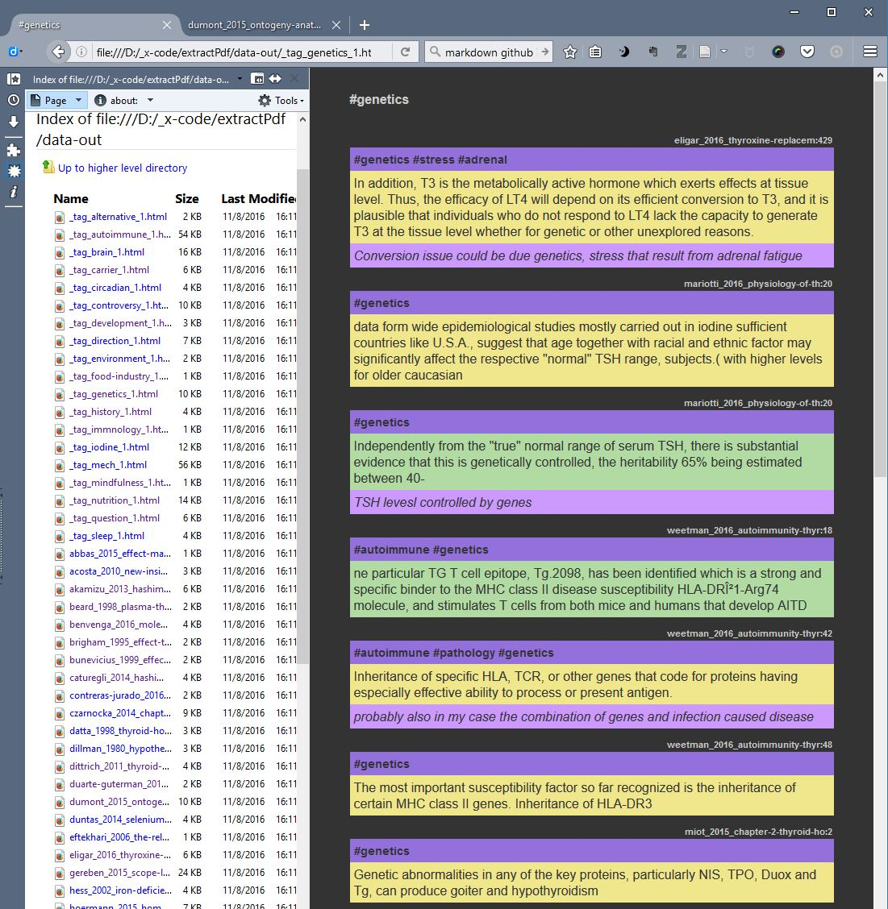

PDF Annotation Extractor
PDF-Zotfile-Html

# Intro
Collecting bits of information, re-organising and merging them is an fundamental part of a knowledge worker.

Tools and procedures are in this context as important as it is for industrial work. Only the nature of the medium has changed. Surprisingly, there is no such tools and procedures are little developed for knowledge workers. You can markup pdfs in various pdf readers, but your notes remain locked inside the file. Zotero and Zotfile can extract markup, but it remains within the Zotero environment in which extract markup and other notes are not easily manipulated.
 
Your Evernotes or webclipping in Hypothes.is or Diigo are equally locked into their own domains. So if you find and interesting passage in a pdf about the effect of climate change and another such passage on a webpage, you cannot easily see whose two in a single integrated interface. 

Recently (september 2016) I have seen that Hypothes.is is aiming integrating markup from many different types of media, so there is hope, but nevertheless I will in the following present a script that takes the extracted annotations from Zotfile and brings them out into a easily navigational file structure.

From there it should be fairly easy to either export the markup to an online repository such as wordpress site or hypothes.is, but I have left that out for now. The most interesting aspect of this script may be the markup process that it enables goes into it.

I find the following three elements important when marking up:
- highlights: This marks up text in the document and I would further more like to add comment or some tags to that particular text.
- image: This is a picture of an area of a page. Often it is a picture of an graphical element of the page that cannot be marked up as text. Again I would like to add a comment and tags.
- sticky notes: A comment which is referring to a page or maybe the whole document. Such comment may also be tagged.

The content should form part of a database so that you can choose to either see all the elements related to a particular source (smith_2016_title.pdf), a tag (#climate) or type of markup (highlight/image/sticky-note).

Furthermore I would like to come in two flavours - important #1 and not important #2 - so I can at any point filter away the less important.

The present script does only produce static html files, but it does so by exporting a html for each source and tag. For the tag files only the important elements are included while source files include everything.

In Firefox I open the folder with the created html files in the sidebar, so I can easily click and view them in main window on the right.

There are also a file that includes all possible elements and another that takes all elements that was not tagged. Hopefully it will in this way meet most requirements of everyday use despite it being static in nature. In its present form it is therefore also necessary to remake all files if there are any changes or new additions. Though it is only a matter of running the script it is not optimal.

# Setup
If you want to have a go with the script with your Zotero/Zotfile you need to change the about:config 

extensions.zotfile.pdfExtraction.formatAnnotationHighlight:
>  

%(content)

%(cite)

extensions.zotfile.pdfExtraction.formatAnnotationNote:
> 

%(content)

%(cite)

extensions.zotfile.pdfExtraction.formatAnnotationUnderline:
> 

<u>%(content)</u>

%(cite)

extensions.zotfile.pdfExtraction.formatNoteTitle:
> 

%(title): %(date)

%(date)

You should also markup with a particular color code:
- Highlight 1: '255,255,0','ffff00'
- Highlight 2:'0,255,0','00ff00'
- Sticky-note 1 / Image 1: '255,0,255','ff00ff','d500f9'
- Sticky-note 2 / Image 2: '0,255,255','00ffff','00b0ff'

These colors are standard in Acrobat Pro on Windows and Xono on Android.

## About image notes
This is not a feature that is available in current pdf readers so you have to wrap you head around it. I do the following:

With the pdf open I make a screen shot with one of the many available software. In windows there is for example the standard 'snipping tool'. I save the image to my NAS in a location called Z:/mm/repo. Now I enter the text 'img@Zmm/file.jpg' into a sticky note and add any comment or tag that I wish. The script will detect the 'img@Z' and convert it into an image note that shows the image. If you store your images in a different location you can change that in the script.

